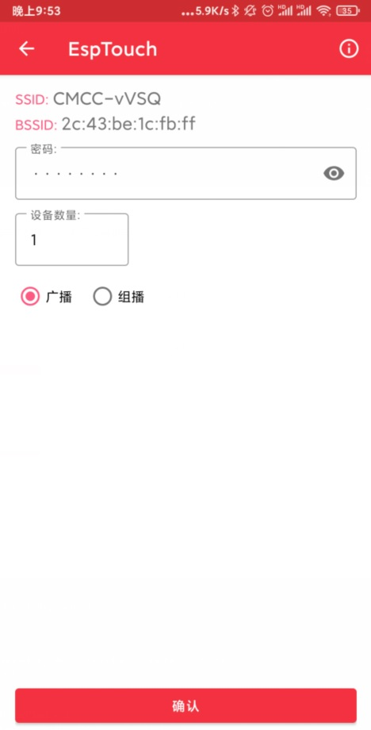
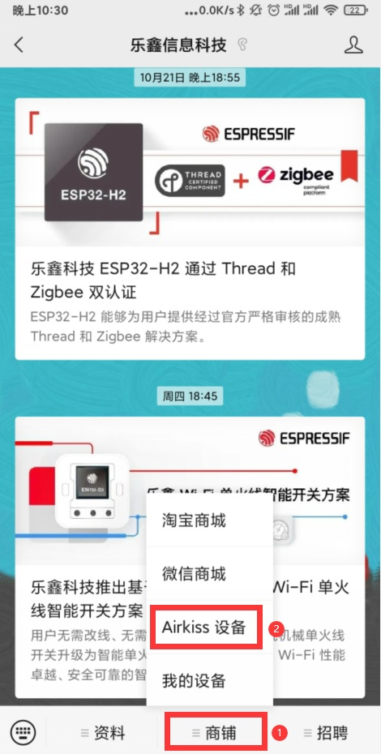
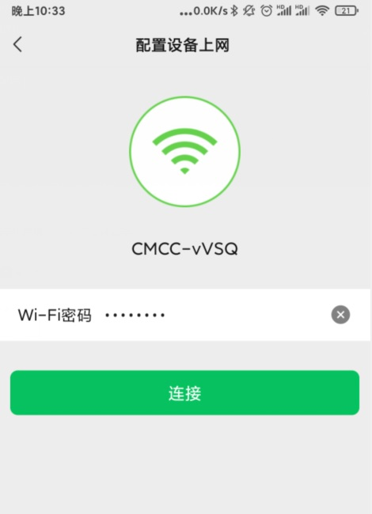
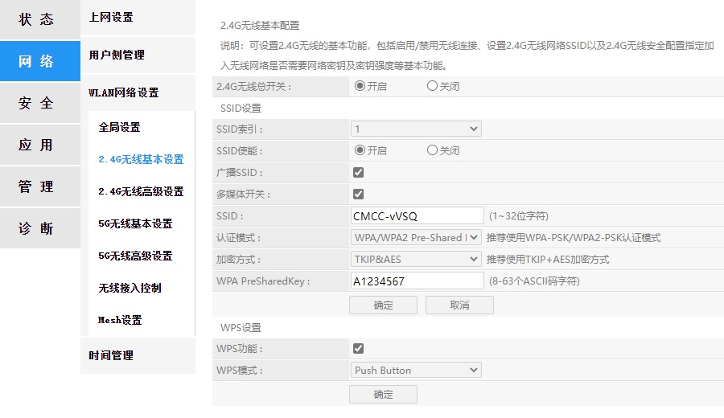

# 52_WIFI_SmartConfig_EspTouch_AirKiss

## 一、例程简介

前面Demo的`WIFI`连接，是通过提前烧录在ESP设备中的字符串来配网，而在产品中不会存在每个用户定制一个固件这种操作，并且这样操作非常麻烦，不利于n次配网，极大降低了使用体验。

通常物联设备的`WIFI配网`，都是在手机上使用自家的软件或者网页进行二次配网。

乐鑫的`SmartConfig`，就是借助WIFI来实现配网的一种协议，通过广播的方式将WiFi AP的SSID和密码发送出去，因为主体已经封装好，二次开发起来简单方便，配网速度快。

easyio的`SmartConfig例程`主体流程，参照了IDF的`smartconfig Example`。
但在其基础上进行了深度优化，增加了更为人性化的`存储以便下次开机自动连接`、`SSID密码错误检测`、`密码错误重试后自动切换为配网`等功能，基本符合日常使用习惯，且重启后连接WIFI速度快，可直接用于实际项目。
- 增加了 `NVS存储` 的功能，只需成功配网一次，设备下次重启后会自动连接。
- 增加了 `SSID与密码错误判断`。在设备开机后，成功连接到WIFI热点前，如自动连接次数超过 RETYR_SSID_NUM，则判断为SSID密码错误，会自动切换为 SmartConfig配网。而无需额外的按键辅助配网。
- 保留了以前的自动重连功能。在设备开机后，成功连接到WIFI热点后，如再遇到WIFI断连，则只会一直按照先前的配置重连，并不会误切换为配网。
- SmartConfig方式默认配置为 `SC_TYPE_ESPTOUCH_AIRKISS`，可同时使用 `ESPTOUCH` 和 `AIRKISS` 共存，对设备连接方式的兼容性更好。
- 重要代码部分添加了中文注释，方便理解。
- 模块化封装，方便其他工程调用。

使用 `SmartConfig`，就可以放弃以前的在menuconfig预设SSID和密码的方式了。可直接替换以前的 example_disconnect();。


详细API说明可见：

[ESP-IDF ESP-NETIF](https://docs.espressif.com/projects/esp-idf/zh_CN/latest/esp32/api-reference/network/esp_netif.html)

[ESP-IDF SmartConfig](https://docs.espressif.com/projects/esp-idf/zh_CN/latest/esp32/api-reference/network/esp_smartconfig.html)

***

## 二、如何使用

SmartConfig 有两种方式：`ESPTOUCH` 和 `AirKiss`。

- ESPTOUCH 需要在手机安装 `ESPTOUCH` APP，源码开源，可以方便的集成到自己的APP中。

- SmartConfig 借助微信小程序，需要用户手机安装有微信，一般应用在微信小程序、公众号。


### 2.1、手机用ESPTOUCH APP配网

1. ESP32运行此例程。

2. 因ESP32没有5.8GHz频段，而`ESPTOUCH`与`AIRKISS`一样，只能使ESP32连接到与手机同一个热点。所以手机配网这段时间也要连接2.4GHz的wifi。

3. 手机下载 `ESPTOUCH` APP: 

- [Android source code](https://github.com/EspressifApp/EsptouchForAndroid)

- [iOS source code](https://github.com/EspressifApp/EsptouchForIOS)

4. 运行 `ESPTOUCH`，输入WIFI热点的密码，方式选择为广播，点击确认。



5. 稍后即可在调试终端上，看到已连接的提示。

<br/>

### 2.2、手机用微信 AIRKISS配网

1. ESP32运行此例程。

2. 因ESP32没有5.8GHz频段，而`AIRKISS`与`ESPTOUCH`一样，只能使ESP32连接到与手机同一个热点。所以手机配网这段时间也要连接2.4GHz的wifi。

3. 打开手机微信，打开如下链接：[ESP AIRKISS配网](http://iot.espressif.cn/configWXDeviceWiFi.html) 

或者关注乐鑫微信公众号，点击下方 `商铺` - `AirKiss设备`。



4. 输入WIFI热点的密码，点击连接。



5. 稍后即可在调试终端上，看到已连接的提示。


### 2.3、配网成功过一次，设备会保存密码，重启后会读取密码自动连接（连接速度快）


### 2.4、设备的网络发生改变，读取密码重试，超出最大重试次数后，判断为密码错误，自动切换为 SmartConfig配网

<br/>

***

## 三、运行现象

### 3.1、手机用ESPTOUCH APP配网

第一次配网的时间可能略久。

```
I (0) cpu_start: App cpu up.
I (441) heap_init: Initializing. RAM available for dynamic allocation:
I (448) heap_init: At 3FFAE6E0 len 00001920 (6 KiB): DRAM
I (454) heap_init: At 3FFB7988 len 00028678 (161 KiB): DRAM
I (460) heap_init: At 3FFE0440 len 00003AE0 (14 KiB): D/IRAM
I (466) heap_init: At 3FFE4350 len 0001BCB0 (111 KiB): D/IRAM
I (473) heap_init: At 400955FC len 0000AA04 (42 KiB): IRAM
I (479) cpu_start: Pro cpu start user code
I (497) spi_flash: detected chip: generic
I (498) spi_flash: flash io: dio
I (498) cpu_start: Starting scheduler on PRO CPU.
I (0) cpu_start: Starting scheduler on APP CPU.
I (506) main: [APP] Startup..
I (506) main: [APP] Free memory: 279176 bytes
I (516) main: [APP] IDF version: v4.2.2-dirty
I (516) gpio: GPIO[33]| InputEn: 1| OutputEn: 1| OpenDrain: 0| Pullup: 0| Pulldown: 0| Intr:0 
I (556) wifi:wifi driver task: 3ffc0ae8, prio:23, stack:6656, core=0
I (556) system_api: Base MAC address is not set
I (556) system_api: read default base MAC address from EFUSE
I (566) wifi:wifi firmware version: bb6888c
I (566) wifi:wifi certification version: v7.0
I (566) wifi:config NVS flash: enabled
I (566) wifi:config nano formating: disabled
I (576) wifi:Init data frame dynamic rx buffer num: 32
I (576) wifi:Init management frame dynamic rx buffer num: 32
I (586) wifi:Init management short buffer num: 32
I (586) wifi:Init dynamic tx buffer num: 32
I (596) wifi:Init static rx buffer size: 1600
I (596) wifi:Init static rx buffer num: 10
I (596) wifi:Init dynamic rx buffer num: 32
I (606) wifi_init: rx ba win: 6
I (606) wifi_init: tcpip mbox: 32
I (616) wifi_init: udp mbox: 6
I (616) wifi_init: tcp mbox: 6
I (616) wifi_init: tcp tx win: 5744
I (626) wifi_init: tcp rx win: 5744
I (626) wifi_init: tcp mss: 1440
I (636) wifi_init: WiFi IRAM OP enabled
I (636) wifi_init: WiFi RX IRAM OP enabled
I (646) phy_init: phy_version 4660,0162888,Dec 23 2020
I (746) wifi:mode : sta (08:3a:f2:4a:3f:88)
W (746) smartconfig_example: 1
I (746) smartconfig_example: get ssid | password from smartconfig
I (806) smartconfig: SC version: V2.9.0
I (4906) wifi:ic_enable_sniffer
I (4906) smartconfig: Start to find channel...
W (4906) smartconfig_example: 4
I (4906) smartconfig_example: Scan done
I (45816) smartconfig: TYPE: ESPTOUCH
I (45816) smartconfig: T|AP MAC: 2c:43:be:1c:fb:ff
I (45816) smartconfig: Found channel on 1-0. Start to get ssid and password...
W (45826) smartconfig_example: 5
I (45826) smartconfig_example: Found channel
I (51156) smartconfig: T|pswd: vPp52YWM
I (51156) smartconfig: T|ssid: CMCC-vVSQ
I (51156) smartconfig: T|bssid: 2c:43:be:1c:fb:ff
I (51156) wifi:ic_disable_sniffer
W (51166) smartconfig_example: 6
I (51166) smartconfig_example: Got SSID and password
I (51176) smartconfig_example: bssid_set:1
I (51176) smartconfig_example: SSID:CMCC-vVSQ
I (51186) smartconfig_example: PASSWORD:vPp52YWM
I (51216) wifi:new:<1,0>, old:<1,0>, ap:<255,255>, sta:<1,0>, prof:1
I (51996) wifi:state: init -> auth (b0)
I (51996) wifi:state: auth -> assoc (0)
I (52006) wifi:state: assoc -> run (10)
I (52026) wifi:connected with CMCC-vVSQ, aid = 5, channel 1, BW20, bssid = 2c:43:be:1c:fb:ff
I (52026) wifi:security: WPA2-PSK, phy: bgn, rssi: -65
I (52036) wifi:pm start, type: 1

I (52076) wifi:AP's beacon interval = 102400 us, DTIM period = 1
I (53046) esp_netif_handlers: sta ip: 192.168.1.8, mask: 255.255.255.0, gw: 192.168.1.1
W (53046) smartconfig_example: 3
I (53046) smartconfig_example: WiFi Connected to ap
W (56106) smartconfig_example: 7
I (56106) smartconfig_example: smartconfig over
```

<br/>

### 3.2、手机用微信 AIRKISS配网

```
I (0) cpu_start: App cpu up.
I (441) heap_init: Initializing. RAM available for dynamic allocation:
I (448) heap_init: At 3FFAE6E0 len 00001920 (6 KiB): DRAM
I (454) heap_init: At 3FFB7988 len 00028678 (161 KiB): DRAM
I (460) heap_init: At 3FFE0440 len 00003AE0 (14 KiB): D/IRAM
I (466) heap_init: At 3FFE4350 len 0001BCB0 (111 KiB): D/IRAM
I (473) heap_init: At 400955FC len 0000AA04 (42 KiB): IRAM
I (479) cpu_start: Pro cpu start user code
I (497) spi_flash: detected chip: generic
I (498) spi_flash: flash io: dio
I (498) cpu_start: Starting scheduler on PRO CPU.
I (0) cpu_start: Starting scheduler on APP CPU.
I (506) main: [APP] Startup..
I (506) main: [APP] Free memory: 279176 bytes
I (516) main: [APP] IDF version: v4.2.2-dirty
I (516) gpio: GPIO[33]| InputEn: 1| OutputEn: 1| OpenDrain: 0| Pullup: 0| Pulldown: 0| Intr:0 
I (556) wifi:wifi driver task: 3ffc0ae8, prio:23, stack:6656, core=0
I (556) system_api: Base MAC address is not set
I (556) system_api: read default base MAC address from EFUSE
I (566) wifi:wifi firmware version: bb6888c
I (566) wifi:wifi certification version: v7.0
I (566) wifi:config NVS flash: enabled
I (566) wifi:config nano formating: disabled
I (576) wifi:Init data frame dynamic rx buffer num: 32
I (576) wifi:Init management frame dynamic rx buffer num: 32
I (586) wifi:Init management short buffer num: 32
I (586) wifi:Init dynamic tx buffer num: 32
I (596) wifi:Init static rx buffer size: 1600
I (596) wifi:Init static rx buffer num: 10
I (596) wifi:Init dynamic rx buffer num: 32
I (606) wifi_init: rx ba win: 6
I (606) wifi_init: tcpip mbox: 32
I (616) wifi_init: udp mbox: 6
I (616) wifi_init: tcp mbox: 6
I (616) wifi_init: tcp tx win: 5744
I (626) wifi_init: tcp rx win: 5744
I (626) wifi_init: tcp mss: 1440
I (636) wifi_init: WiFi IRAM OP enabled
I (636) wifi_init: WiFi RX IRAM OP enabled
I (646) phy_init: phy_version 4660,0162888,Dec 23 2020
I (746) wifi:mode : sta (08:3a:f2:4a:3f:88)
W (746) smartconfig_example: 1
I (746) smartconfig_example: get ssid | password from smartconfig
I (806) smartconfig: SC version: V2.9.0
I (4906) wifi:ic_enable_sniffer
I (4906) smartconfig: Start to find channel...
W (4906) smartconfig_example: 4
I (4906) smartconfig_example: Scan done
I (45816) smartconfig: TYPE: AIRKISS
I (45816) smartconfig: T|AP MAC: 2c:43:be:1c:fb:ff
I (45816) smartconfig: Found channel on 1-0. Start to get ssid and password...
W (45826) smartconfig_example: 5
I (45826) smartconfig_example: Found channel
I (51156) smartconfig: T|pswd: vPp52YWM
I (51156) smartconfig: T|ssid: CMCC-vVSQ
I (51156) smartconfig: T|bssid: 2c:43:be:1c:fb:ff
I (51156) wifi:ic_disable_sniffer
W (51166) smartconfig_example: 6
I (51166) smartconfig_example: Got SSID and password
I (51176) smartconfig_example: bssid_set:1
I (51176) smartconfig_example: SSID:CMCC-vVSQ
I (51186) smartconfig_example: PASSWORD:vPp52YWM
I (51216) wifi:new:<1,0>, old:<1,0>, ap:<255,255>, sta:<1,0>, prof:1
I (51996) wifi:state: init -> auth (b0)
I (51996) wifi:state: auth -> assoc (0)
I (52006) wifi:state: assoc -> run (10)
I (52026) wifi:connected with CMCC-vVSQ, aid = 5, channel 1, BW20, bssid = 2c:43:be:1c:fb:ff
I (52026) wifi:security: WPA2-PSK, phy: bgn, rssi: -65
I (52036) wifi:pm start, type: 1

I (52076) wifi:AP's beacon interval = 102400 us, DTIM period = 1
I (53046) esp_netif_handlers: sta ip: 192.168.1.8, mask: 255.255.255.0, gw: 192.168.1.1
W (53046) smartconfig_example: 3
I (53046) smartconfig_example: WiFi Connected to ap
W (56106) smartconfig_example: 7
I (56106) smartconfig_example: smartconfig over
```

<br/>

### 3.3、配网成功过一次，设备会保存密码，重启后会读取密码自动连接（连接速度快）

```
I (0) cpu_start: App cpu up.
I (441) heap_init: Initializing. RAM available for dynamic allocation:
I (448) heap_init: At 3FFAE6E0 len 00001920 (6 KiB): DRAM
I (454) heap_init: At 3FFB7988 len 00028678 (161 KiB): DRAM
I (460) heap_init: At 3FFE0440 len 00003AE0 (14 KiB): D/IRAM
I (466) heap_init: At 3FFE4350 len 0001BCB0 (111 KiB): D/IRAM
I (473) heap_init: At 400955FC len 0000AA04 (42 KiB): IRAM
I (479) cpu_start: Pro cpu start user code
I (497) spi_flash: detected chip: generic
I (498) spi_flash: flash io: dio
I (498) cpu_start: Starting scheduler on PRO CPU.
I (0) cpu_start: Starting scheduler on APP CPU.
I (506) main: [APP] Startup..
I (506) main: [APP] Free memory: 279176 bytes
I (516) main: [APP] IDF version: v4.2.2-dirty
I (516) gpio: GPIO[33]| InputEn: 1| OutputEn: 1| OpenDrain: 0| Pullup: 0| Pulldown: 0| Intr:0 
I (566) wifi:wifi driver task: 3ffc0c10, prio:23, stack:6656, core=0
I (566) system_api: Base MAC address is not set
I (566) system_api: read default base MAC address from EFUSE
I (586) wifi:wifi firmware version: bb6888c
I (586) wifi:wifi certification version: v7.0
I (586) wifi:config NVS flash: enabled
I (586) wifi:config nano formating: disabled
I (586) wifi:Init data frame dynamic rx buffer num: 32
I (596) wifi:Init management frame dynamic rx buffer num: 32
I (596) wifi:Init management short buffer num: 32
I (606) wifi:Init dynamic tx buffer num: 32
I (606) wifi:Init static rx buffer size: 1600
I (606) wifi:Init static rx buffer num: 10
I (616) wifi:Init dynamic rx buffer num: 32
I (616) wifi_init: rx ba win: 6
I (626) wifi_init: tcpip mbox: 32
I (626) wifi_init: udp mbox: 6
I (626) wifi_init: tcp mbox: 6
I (636) wifi_init: tcp tx win: 5744
I (636) wifi_init: tcp rx win: 5744
I (646) wifi_init: tcp mss: 1440
I (646) wifi_init: WiFi IRAM OP enabled
I (646) wifi_init: WiFi RX IRAM OP enabled
I (656) phy_init: phy_version 4660,0162888,Dec 23 2020
I (766) wifi:mode : sta (08:3a:f2:4a:3f:88)
W (766) smartconfig_example: 1
I (766) smartconfig_example: NVS SSID = CMCC-vVSQ
I (766) smartconfig_example: NVS PASSWD = vPp52YWM
I (766) smartconfig_example: get ssid | password from nvs
I (776) smartconfig_example: SSID:CMCC-vVSQ
I (786) smartconfig_example: PASSWORD:vPp52YWM
I (816) wifi:new:<1,0>, old:<1,0>, ap:<255,255>, sta:<1,0>, prof:1
I (1586) wifi:state: init -> auth (b0)
I (1606) wifi:state: auth -> assoc (0)
I (1606) wifi:state: assoc -> run (10)
I (1626) wifi:connected with CMCC-vVSQ, aid = 5, channel 1, BW20, bssid = 2c:43:be:1c:fb:ff
I (1626) wifi:security: WPA2-PSK, phy: bgn, rssi: -65
I (1636) wifi:pm start, type: 1

I (1666) wifi:AP's beacon interval = 102400 us, DTIM period = 1
I (3056) esp_netif_handlers: sta ip: 192.168.1.8, mask: 255.255.255.0, gw: 192.168.1.1
W (3056) smartconfig_example: 3
```

<br/>

### 3.4、设备的网络发生改变，读取密码重试，超出最大重试次数后，判断为密码错误，自动切换为 SmartConfig配网

更改路由器的WIFI密码，每个路由器的管理菜单都不大一样，仅供参考。



```
I (0) cpu_start: App cpu up.
I (441) heap_init: Initializing. RAM available for dynamic allocation:
I (448) heap_init: At 3FFAE6E0 len 00001920 (6 KiB): DRAM
I (454) heap_init: At 3FFB7988 len 00028678 (161 KiB): DRAM
I (460) heap_init: At 3FFE0440 len 00003AE0 (14 KiB): D/IRAM
I (466) heap_init: At 3FFE4350 len 0001BCB0 (111 KiB): D/IRAM
I (473) heap_init: At 400955FC len 0000AA04 (42 KiB): IRAM
I (479) cpu_start: Pro cpu start user code
I (497) spi_flash: detected chip: generic
I (498) spi_flash: flash io: dio
I (498) cpu_start: Starting scheduler on PRO CPU.
I (0) cpu_start: Starting scheduler on APP CPU.
I (506) main: [APP] Startup..
I (506) main: [APP] Free memory: 279176 bytes
I (516) main: [APP] IDF version: v4.2.2-dirty
I (516) gpio: GPIO[33]| InputEn: 1| OutputEn: 1| OpenDrain: 0| Pullup: 0| Pulldown: 0| Intr:0 
I (566) wifi:wifi driver task: 3ffc0c10, prio:23, stack:6656, core=0
I (566) system_api: Base MAC address is not set
I (566) system_api: read default base MAC address from EFUSE
I (586) wifi:wifi firmware version: bb6888c
I (586) wifi:wifi certification version: v7.0
I (586) wifi:config NVS flash: enabled
I (586) wifi:config nano formating: disabled
I (586) wifi:Init data frame dynamic rx buffer num: 32
I (596) wifi:Init management frame dynamic rx buffer num: 32
I (596) wifi:Init management short buffer num: 32
I (606) wifi:Init dynamic tx buffer num: 32
I (606) wifi:Init static rx buffer size: 1600
I (606) wifi:Init static rx buffer num: 10
I (616) wifi:Init dynamic rx buffer num: 32
I (616) wifi_init: rx ba win: 6
I (626) wifi_init: tcpip mbox: 32
I (626) wifi_init: udp mbox: 6
I (626) wifi_init: tcp mbox: 6
I (636) wifi_init: tcp tx win: 5744
I (636) wifi_init: tcp rx win: 5744
I (646) wifi_init: tcp mss: 1440
I (646) wifi_init: WiFi IRAM OP enabled
I (646) wifi_init: WiFi RX IRAM OP enabled
I (656) phy_init: phy_version 4660,0162888,Dec 23 2020
I (766) wifi:mode : sta (08:3a:f2:4a:3f:88)
W (766) smartconfig_example: 1
I (766) smartconfig_example: NVS SSID = CMCC-vVSQ
I (766) smartconfig_example: NVS PASSWD = vPp52YWM
I (766) smartconfig_example: get ssid | password from nvs
I (776) smartconfig_example: SSID:CMCC-vVSQ
I (776) smartconfig_example: PASSWORD:vPp52YWM
I (796) wifi:new:<1,0>, old:<1,0>, ap:<255,255>, sta:<1,0>, prof:1
I (796) wifi:state: init -> auth (b0)
I (806) wifi:state: auth -> assoc (0)
I (816) wifi:state: assoc -> run (10)
I (6826) wifi:state: run -> init (fc0)
I (6826) wifi:new:<1,0>, old:<1,0>, ap:<255,255>, sta:<1,0>, prof:1
I (6826) wifi:new:<1,0>, old:<1,0>, ap:<255,255>, sta:<1,0>, prof:1
W (6826) smartconfig_example: 2
W (6836) smartconfig_example: wifi disconnected! retry
W (6836) smartconfig_example: fail num = 1
W (8876) smartconfig_example: 2
W (8886) smartconfig_example: wifi disconnected! retry
W (8886) smartconfig_example: fail num = 2
I (8886) wifi:new:<1,0>, old:<1,0>, ap:<255,255>, sta:<1,0>, prof:1
I (8886) wifi:state: init -> auth (b0)
I (8906) wifi:state: auth -> assoc (0)
I (8906) wifi:state: assoc -> run (10)
I (14926) wifi:state: run -> init (fc0)
I (14926) wifi:new:<1,0>, old:<1,0>, ap:<255,255>, sta:<1,0>, prof:1
I (14926) wifi:new:<1,0>, old:<1,0>, ap:<255,255>, sta:<1,0>, prof:1
W (14926) smartconfig_example: 2
W (14936) smartconfig_example: wifi disconnected! retry
W (14936) smartconfig_example: fail num = 3
W (16986) smartconfig_example: 2
W (16986) smartconfig_example: wifi disconnected! retry
W (16986) smartconfig_example: fail num = 4
I (17046) wifi:new:<1,0>, old:<1,0>, ap:<255,255>, sta:<1,0>, prof:1
I (17046) wifi:state: init -> auth (b0)
I (17046) wifi:state: auth -> assoc (0)
I (17046) wifi:state: assoc -> run (10)
I (23066) wifi:state: run -> init (fc0)
I (23066) wifi:new:<1,0>, old:<1,0>, ap:<255,255>, sta:<1,0>, prof:1
I (23066) wifi:new:<1,0>, old:<1,0>, ap:<255,255>, sta:<1,0>, prof:1
W (23076) smartconfig_example: 2
W (23076) smartconfig_example: wifi disconnected! retry
W (23086) smartconfig_example: fail num = 5
W (23086) smartconfig_example: nvs config fail! then get ssid | password from smartconfig
I (23146) smartconfig: SC version: V2.9.0
I (27246) wifi:ic_enable_sniffer
I (27246) smartconfig: Start to find channel...
W (27246) smartconfig_example: 4
I (27246) smartconfig_example: Scan done
I (45986) smartconfig: TYPE: AIRKISS
I (45986) smartconfig: T|AP MAC: 2c:43:be:1c:fb:ff
I (45986) smartconfig: Found channel on 1-0. Start to get ssid and password...
W (45986) smartconfig_example: 5
I (45996) smartconfig_example: Found channel
I (53556) smartconfig: T|pswd: A1234567
I (53556) smartconfig: T|ssid: CMCC-vVSQ
I (53556) wifi:ic_disable_sniffer
W (53556) smartconfig_example: 6
I (53566) smartconfig_example: Got SSID and password
I (53566) smartconfig_example: bssid_set:0
I (53576) smartconfig_example: SSID:CMCC-vVSQ
I (53576) smartconfig_example: PASSWORD:A1234567
I (53616) wifi:new:<1,0>, old:<1,0>, ap:<255,255>, sta:<1,0>, prof:1
I (54386) wifi:state: init -> auth (b0)
I (54396) wifi:state: auth -> assoc (0)
I (54396) wifi:state: assoc -> run (10)
I (54426) wifi:connected with CMCC-vVSQ, aid = 4, channel 1, BW20, bssid = 2c:43:be:1c:fb:ff
I (54426) wifi:security: WPA2-PSK, phy: bgn, rssi: -66
I (54436) wifi:pm start, type: 1

I (54516) wifi:AP's beacon interval = 102400 us, DTIM period = 1
I (55556) esp_netif_handlers: sta ip: 192.168.1.8, mask: 255.255.255.0, gw: 192.168.1.1
W (55556) smartconfig_example: 3
I (55556) smartconfig_example: WiFi Connected to ap
W (58636) smartconfig_example: 7
I (58636) smartconfig_example: smartconfig over
```

<br/>

***

## 四、注意事项

- 检测SSID密码错误的重试次数，是 `wifi_smartconfig.h` 中的 `RETYR_SSID_NUM`，默认为5次。

- ESP32没有5.8GHz频段，而`ESPTOUCH`只能配置ESP32与手机连接相同WIFI热点，所以手机这段时间也要连接2.4GHz的wifi。

- 必须要在WIFI热点开机之后，ESP32才能运行 SmartConfig，顺序反了会失败。因为 SmartConfig会先扫描WIFI通道，如果在扫描期间，WIFI热点没有开机，则 SmartConfig不会对其有作用。

- `smartconfig_type_t` 的方式有3种：一种为`ESPTOUCH`，另一种为`AIRKISS`，还有一种 `SC_TYPE_ESPTOUCH_AIRKISS` 两者共存的方式。推荐使用 `SC_TYPE_ESPTOUCH_AIRKISS`，以便两种方式都可以使用。

- 完全可以用NVS，将能连接成功的热点的SSID和PASSWORD都列表记下，以方便下次上电后的自动连接。ESP-IDF自带的Demo - `smartconfig Example`，只提供了配网流程，没有使用NVS存储，这个在easyio库中的得到了补全，并对完善了自动切换和重连。

- 使用 `SmartConfig`，就可以放弃以前的在menuconfig预设SSID和密码的方式了。可直接替换以前的 example_disconnect();。

- `SmartConfig`的第一次配网的时间可能略久，请耐心等待。乐鑫有更快的配网方式，Blufi，需要使用蓝牙。
