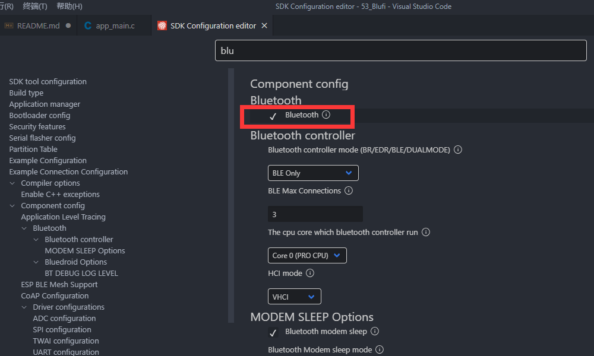
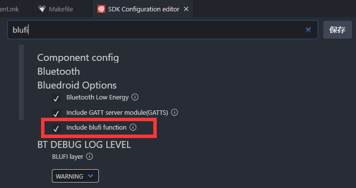
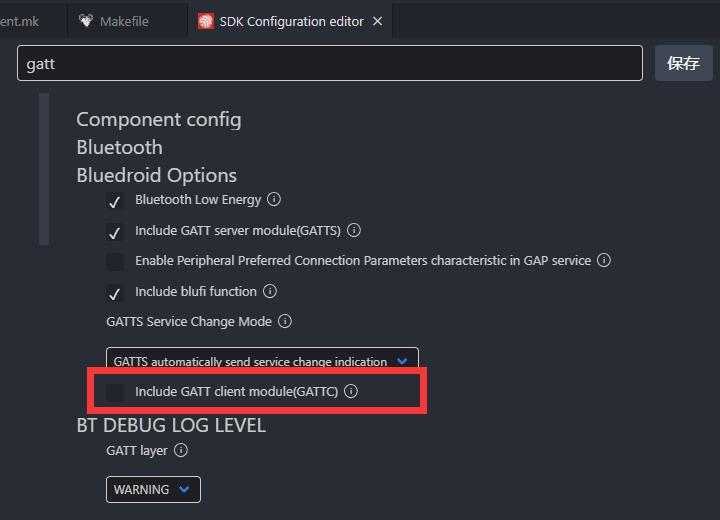
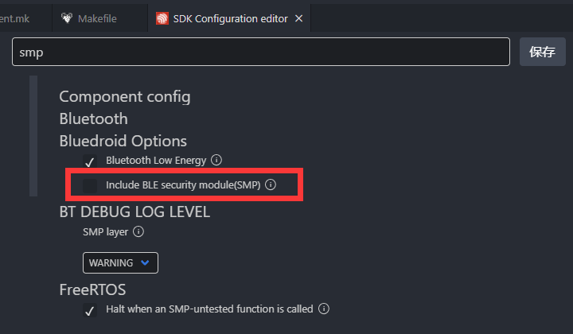
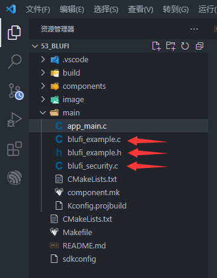
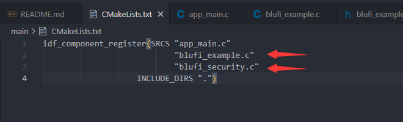
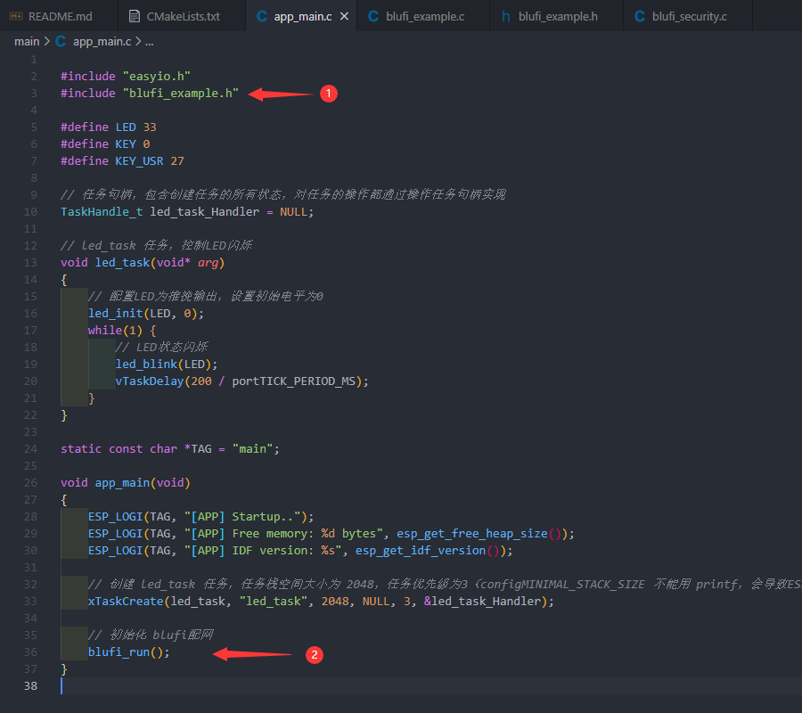

# 53_Blufi

## 一、例程简介

作为集成 2.4 GHz Wi-Fi 和蓝⽛双模的单芯⽚⽅案，ESP32 ⽀持 `SmartConfig` 和`蓝⽛配⽹`两种模式，⽤户可以使⽤ ESP32 为物联⽹设备进⾏安全配⽹。

blufi蓝⽛在设备配置⽅⾯有以下优势：
- 蓝⽛协议公开并且容易扩展。
- 通过蓝⽛可以便捷地搜索到附近的蓝⽛设备。
- 蓝⽛协议安全性⾼，⽤户通过蓝⽛连接给设备授权后，才把密码传输到设备端。
- 在路由⽆法正常⼯作的情况下，客户还能通过蓝⽛把数据传输给⼿机，通过⼿机把数据上传到⽹络。
- 在 Wi-Fi 出现问题的时候，⼿机也能连接蓝⽛设备，通过发送指令控制设备。

蓝牙配网的一大直观好处，是配网速度非常快。`SmartConfig`的配网时间，会根据WIFI环境不同，从瞬间连接到几十s不等。而蓝牙连接非常稳定，点击配网既有响应。

IDF中的`blufi`例程，其完善程度相较于之前的`SmartConfig`更好，附带了SSID和密码存储，以便下次重启后无需等待配网，自动连接WIFI。

本例程参照IDF中的`blufi`。

***

## 二、如何在自己工程中集成 blufi功能

使用 `Blufi`，需要先配置menuconfig：

- 1、使能 蓝牙。

- 2、使能 blufi。

- 3、关闭 GATTC。（也可使能）

- 4、关闭 SMP。（也可使能）


- 5、因 `Blufi` 所涉及的文件过多，多次尝试集成进easyio都未能成功，所以如要使用`Blufi`，还需手动将`blufi_security.c`、`blufi_example.c`、`blufi_example.h`三个文件，复制到main文件夹下。


- 6、更改main文件夹下的`CMakeLists.txt`，包含源文件`blufi_example.c`、`blufi_security.c`。


- 7、main中包含头文件，任务中运行blufi。


***

## 三、手机APP配网使用方法

手机APP EspBlufi 配网的过程，参考官方文档：
* [Bluetooth Network User Guide CN](https://www.espressif.com/sites/default/files/documentation/esp32_bluetooth_networking_user_guide_cn.pdf)

***

## 四、APP及源码下载

安卓APP下载：[EspBlufi_1.6.0](https://github.com/EspressifApp/EspBlufiForAndroid/releases)

To test this demo, you need to prepare a mobile phone with blufi application installed. You can download the blufi application from [Android version](https://github.com/EspressifApp/EspBlufi) and [iOS version](https://itunes.apple.com/cn/app/espblufi/id1450614082?mt=8).

Blufi is completely open source, here is the download link:

* [blufi source code](https://github.com/espressif/esp-idf/tree/master/examples/bluetooth/bluedroid/ble/blufi)

* [BluFi protocol](https://docs.espressif.com/projects/esp-idf/en/latest/api-guides/blufi.html?highlight=blufi#the-frame-formats-defined-in-blufi)

* [iOS source code](https://github.com/EspressifApp/EspBlufiForiOS)

* [Android source code](https://github.com/EspressifApp/EspBlufi)


## 五、运行现象

### 5.1、第一次用 blufi 配网

第一次配网，因ESP32的尚未记忆SSID和密码，无法自动连接WIFI，需等待手机APP配网。

因ESP32烧录程序时，不会清空整个Flash，会导致NVS依旧存储着以前保留的SSID和密码。

这时需要手动`清空Flash`，命令窗口输入 `idf.py erase_flash`。

之后下载程序运行：

```
I (0) cpu_start: App cpu up.
I (560) heap_init: Initializing. RAM available for dynamic allocation:
I (567) heap_init: At 3FFAFF10 len 000000F0 (0 KiB): DRAM
I (573) heap_init: At 3FFB6388 len 00001C78 (7 KiB): DRAM
I (579) heap_init: At 3FFB9A20 len 00004108 (16 KiB): DRAM
I (585) heap_init: At 3FFCB330 len 00014CD0 (83 KiB): DRAM
I (591) heap_init: At 3FFE0440 len 00003AE0 (14 KiB): D/IRAM
I (598) heap_init: At 3FFE4350 len 0001BCB0 (111 KiB): D/IRAM
I (604) heap_init: At 4009DAA4 len 0000255C (9 KiB): IRAM
I (610) cpu_start: Pro cpu start user code
I (629) spi_flash: detected chip: generic
I (629) spi_flash: flash io: dio
I (630) cpu_start: Starting scheduler on PRO CPU.
I (0) cpu_start: Starting scheduler on APP CPU.
I (637) main: [APP] Startup..
I (637) main: [APP] Free memory: 216288 bytes
I (647) main: [APP] IDF version: v4.2.2-dirty
I (647) gpio: GPIO[33]| InputEn: 1| OutputEn: 1| OpenDrain: 0| Pullup: 0| Pulldown: 0| Intr:0 
I (697) wifi:wifi driver task: 3ffd00cc, prio:23, stack:6656, core=0
I (697) system_api: Base MAC address is not set
I (697) system_api: read default base MAC address from EFUSE
I (707) wifi:wifi firmware version: bb6888c
I (707) wifi:wifi certification version: v7.0
I (707) wifi:config NVS flash: enabled
I (707) wifi:config nano formating: disabled
I (717) wifi:Init data frame dynamic rx buffer num: 32
I (717) wifi:Init management frame dynamic rx buffer num: 32
I (727) wifi:Init management short buffer num: 32
I (727) wifi:Init dynamic tx buffer num: 32
I (737) wifi:Init static rx buffer size: 1600
I (737) wifi:Init static rx buffer num: 10
I (737) wifi:Init dynamic rx buffer num: 32
I (747) wifi_init: rx ba win: 6
I (747) wifi_init: tcpip mbox: 32
I (757) wifi_init: udp mbox: 6
I (757) wifi_init: tcp mbox: 6
I (757) wifi_init: tcp tx win: 5744
I (767) wifi_init: tcp rx win: 5744
I (767) wifi_init: tcp mss: 1440
I (777) wifi_init: WiFi IRAM OP enabled
I (777) wifi_init: WiFi RX IRAM OP enabled
I (787) phy_init: phy_version 4660,0162888,Dec 23 2020
I (887) wifi:mode : sta (40:91:51:28:d0:d0)
I (887) BTDM_INIT: BT controller compile version [ba56601]
I (887) phy_init: phy_version 4660,0162888,Dec 23 2020
I (1217) BLUFI_EXAMPLE: BD ADDR: 40:91:51:28:d0:d2

I (1217) BLUFI_EXAMPLE: BLUFI VERSION 0102

I (1217) BLUFI_EXAMPLE: BLUFI init finish

```

手机APP EspBlufi 配网的过程，参考官方文档：
* [Bluetooth Network User Guide CN](https://www.espressif.com/sites/default/files/documentation/esp32_bluetooth_networking_user_guide_cn.pdf)

手机 EspBlufi APP连接、配网、断开：

```
I (69907) BLUFI_EXAMPLE: BLUFI ble connect

I (79937) BLUFI_EXAMPLE: BLUFI Set WIFI opmode 1

I (79987) BLUFI_EXAMPLE: Recv STA SSID CMCC-vVSQ

I (80037) BLUFI_EXAMPLE: Recv STA PASSWORD vPp52YWM

I (80057) BLUFI_EXAMPLE: BLUFI requset wifi connect to AP

I (81277) wifi:new:<6,0>, old:<1,0>, ap:<255,255>, sta:<6,0>, prof:1
I (82117) wifi:state: init -> auth (b0)
I (82137) wifi:state: auth -> assoc (0)
I (82147) wifi:state: assoc -> run (10)
I (82167) wifi:connected with CMCC-vVSQ, aid = 4, channel 6, BW20, bssid = 2c:43:be:1c:fb:ff
I (82167) wifi:security: WPA2-PSK, phy: bgn, rssi: -67
I (82177) wifi:pm start, type: 1

I (82177) wifi:AP's beacon interval = 102400 us, DTIM period = 1
I (83677) esp_netif_handlers: sta ip: 192.168.1.3, mask: 255.255.255.0, gw: 192.168.1.1
I (88657) BLUFI_EXAMPLE: blufi close a gatt connection
I (88657) BLUFI_EXAMPLE: BLUFI ble disconnect
```


<br/>

### 5.2、配网成功过一次，且设备的WIFI环境未发生变化，重启后会自动连接

```
I (0) cpu_start: App cpu up.
I (560) heap_init: Initializing. RAM available for dynamic allocation:
I (567) heap_init: At 3FFAFF10 len 000000F0 (0 KiB): DRAM
I (573) heap_init: At 3FFB6388 len 00001C78 (7 KiB): DRAM
I (579) heap_init: At 3FFB9A20 len 00004108 (16 KiB): DRAM
I (585) heap_init: At 3FFCB330 len 00014CD0 (83 KiB): DRAM
I (591) heap_init: At 3FFE0440 len 00003AE0 (14 KiB): D/IRAM
I (598) heap_init: At 3FFE4350 len 0001BCB0 (111 KiB): D/IRAM
I (604) heap_init: At 4009DAA4 len 0000255C (9 KiB): IRAM
I (610) cpu_start: Pro cpu start user code
I (629) spi_flash: detected chip: generic
I (629) spi_flash: flash io: dio
I (630) cpu_start: Starting scheduler on PRO CPU.
I (0) cpu_start: Starting scheduler on APP CPU.
I (637) main: [APP] Startup..
I (637) main: [APP] Free memory: 216288 bytes
I (647) main: [APP] IDF version: v4.2.2-dirty
I (647) gpio: GPIO[33]| InputEn: 1| OutputEn: 1| OpenDrain: 0| Pullup: 0| Pulldown: 0| Intr:0 
I (697) wifi:wifi driver task: 3ffd0150, prio:23, stack:6656, core=0
I (697) system_api: Base MAC address is not set
I (697) system_api: read default base MAC address from EFUSE
I (717) wifi:wifi firmware version: bb6888c
I (717) wifi:wifi certification version: v7.0
I (717) wifi:config NVS flash: enabled
I (717) wifi:config nano formating: disabled
I (717) wifi:Init data frame dynamic rx buffer num: 32
I (717) wifi:Init management frame dynamic rx buffer num: 32
I (727) wifi:Init management short buffer num: 32
I (727) wifi:Init dynamic tx buffer num: 32
I (737) wifi:Init static rx buffer size: 1600
I (737) wifi:Init static rx buffer num: 10
I (747) wifi:Init dynamic rx buffer num: 32
I (747) wifi_init: rx ba win: 6
I (747) wifi_init: tcpip mbox: 32
I (757) wifi_init: udp mbox: 6
I (757) wifi_init: tcp mbox: 6
I (767) wifi_init: tcp tx win: 5744
I (767) wifi_init: tcp rx win: 5744
I (767) wifi_init: tcp mss: 1440
I (777) wifi_init: WiFi IRAM OP enabled
I (777) wifi_init: WiFi RX IRAM OP enabled
I (787) phy_init: phy_version 4660,0162888,Dec 23 2020
I (887) wifi:mode : sta (40:91:51:28:d0:d0)
I (887) BTDM_INIT: BT controller compile version [ba56601]
I (897) phy_init: phy_version 4660,0162888,Dec 23 2020
I (897) wifi:new:<6,0>, old:<1,0>, ap:<255,255>, sta:<6,0>, prof:1
I (897) wifi:state: init -> auth (b0)
I (917) wifi:state: auth -> assoc (0)
I (917) wifi:state: assoc -> run (10)
I (1167) wifi:connected with CMCC-vVSQ, aid = 4, channel 6, BW20, bssid = 2c:43:be:1c:fb:ff
I (1167) wifi:security: WPA2-PSK, phy: bgn, rssi: -63
I (1177) wifi:pm start, type: 1

I (1247) BLUFI_EXAMPLE: BD ADDR: 40:91:51:28:d0:d2

I (1247) BLUFI_EXAMPLE: BLUFI VERSION 0102

I (1257) BLUFI_EXAMPLE: BLUFI init finish

I (1257) wifi:AP's beacon interval = 102400 us, DTIM period = 1
I (2187) esp_netif_handlers: sta ip: 192.168.1.3, mask: 255.255.255.0, gw: 192.168.1.1
I (2187) BLUFI_EXAMPLE: BLUFI BLE is not connected yet
```

<br/>

***

## 六、注意事项

