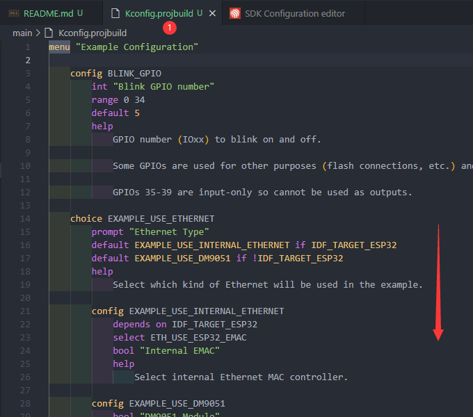
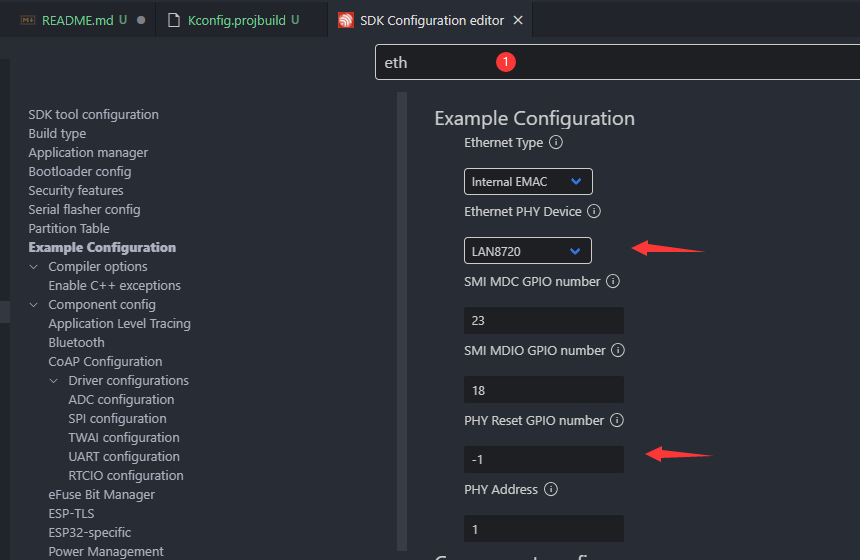
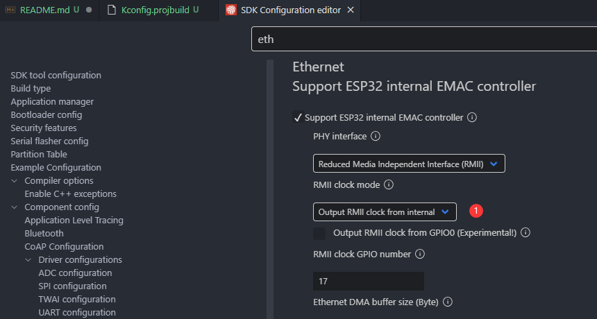
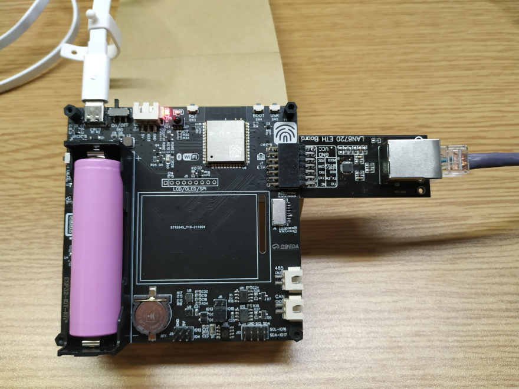
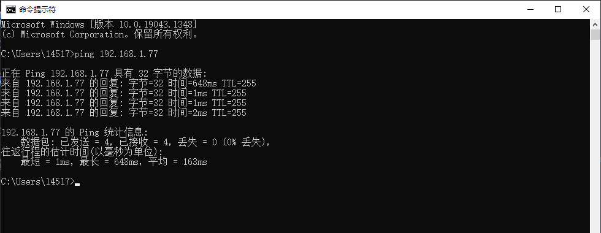

# 54_ETH_DHCP

## 一、例程简介

&emsp;&emsp;本例程取自IDF的以太网Demo - `basic`、`iperf`。更多以太网例程可见 `eth2ap`。

&emsp;&emsp;将原有的以太网注册过程分离出来，封装进easyio，并通过预留的`事件组`作为对外的通知。

&emsp;&emsp;以太网注册成功，并DHCP获得到IP后，会将 `eth_event_group 事件组`的 GOTIP_BIT 置位。用户可在外部，由此事件组进行后续的事件处理。

&emsp;&emsp;ETH详细API说明：

&emsp;&emsp;[ESP-IDF ESP-NETIF](https://docs.espressif.com/projects/esp-idf/zh_CN/latest/esp32/api-reference/network/esp_netif.html)

&emsp;&emsp;[ESP-IDF Ethernet](https://docs.espressif.com/projects/esp-idf/en/latest/esp32/api-reference/network/esp_eth.html)

&emsp;&emsp;[乐鑫以太网POE开发板 ESP32-Ethernet-Kit V1.2 入门指南](https://docs.espressif.com/projects/esp-idf/zh_CN/latest/esp32/hw-reference/esp32/get-started-ethernet-kit.html)

***

## 二、普通工程如何修改为以太网工程?

- 1、删除原有的sdkconfig配置文件。
- 2、修改Kconfig.projbuild文件，将与ETH有关联的内容复制过来。

- 3、menuconfig。
- 4、修改PHY型号、引脚、时钟。

对照自己的PHY型号和连接的GPIO进行修改。例如`ESP-IOT-KIT`使用的PHY为LAN8720，引脚使用ESP32的默认引脚，RESET引脚空置不连接。

- 5、修改时钟：因为`ESP-IOT-KIT`开发板使用的PHY，是插接的LAN8720模块。LAN8720模块自带50MHz晶振作为它的时钟源，故不需要ESP32对其提供时钟。
但这里的`时钟模式`只有两种可选：输入、输出。如果选择了`输入`，那么ESP32的EMAC时钟就会切换为外部输入，而LAN8720的时钟对外输出需要改驱动，会很麻烦。所以这里选择为`输出`，但不占用GPIO。相当于ESP32和LAN8720各自使用自己的时钟源。

- 6、其他的选项按照默认的即可。最后保存，退出。
- 7、完善main，编译下载运行。
- 8、将`ESP-IOT-KIT`开发板 的液晶屏、TF卡拔出，将LAN8720模块插入。
- 【注意】液晶屏、TF卡可以不拔出，但因为与`ETH`共用IO口，会导致LAN8720的识别和联网速度特别慢。仅插接LAN8720，从开机到DHCP获得IP的时间`一般不会超过5s`。
而同时插接液晶屏、TF卡，所用时间会延长，差的情况有可能导致ETH不能正常连接。
- 9、插入网线，运行程序，观察终端输出，等待从路由器或交换机获得到IP。以太网可用。
- 10、例程中，等待以太网获得IP后，会将LED常量。
- 11、获得到IP后，网线、LAN8720模块均可热插拔，热插拔后并不妨碍自动连接。


***

## 三、以太网PHY型号支持

目前为止，ESP-IDF 最多支持四种以太网 PHY：`LAN8720`、`IP101`、`DP83848` 和 `RTL8201`，额外的 PHY 驱动需要用户自己实现。

除此之外，`esp_eth`组件可以驱动集成MAC和PHY并提供通用通信接口（如SPI、USB等）的第三方以太网模块，如`DM9051`。


***


## 四、运行现象

将LAN8720模块从右侧插接入`ESP-IOT-KIT`开发板。

连接网线到路由器或交换机。




编译下载运行。

```
I (0) cpu_start: App cpu up.
I (294) heap_init: Initializing. RAM available for dynamic allocation:
I (301) heap_init: At 3FFAE6E0 len 00001920 (6 KiB): DRAM
I (307) heap_init: At 3FFB38A8 len 0002C758 (177 KiB): DRAM
I (314) heap_init: At 3FFE0440 len 00003AE0 (14 KiB): D/IRAM
I (320) heap_init: At 3FFE4350 len 0001BCB0 (111 KiB): D/IRAM
I (326) heap_init: At 4008AEC8 len 00015138 (84 KiB): IRAM
I (333) cpu_start: Pro cpu start user code
I (351) spi_flash: detected chip: generic
I (352) spi_flash: flash io: dio
I (352) cpu_start: Starting scheduler on PRO CPU.
I (0) cpu_start: Starting scheduler on APP CPU.
I (360) main: [APP] Startup..
I (360) main: [APP] Free memory: 295836 bytes
I (370) main: [APP] IDF version: v4.2.2-dirty
I (390) system_api: Base MAC address is not set
I (390) system_api: read default base MAC address from EFUSE
I (410) esp_eth.netif.glue: 08:3a:f2:4a:3f:0f
I (410) esp_eth.netif.glue: ethernet attached to netif
I (2110) eth_example: Ethernet Started
I (2110) gpio: GPIO[33]| InputEn: 1| OutputEn: 1| OpenDrain: 0| Pullup: 0| Pulldown: 0| Intr:0 
I (2110) eth_example: Ethernet Link Up
I (2110) eth_example: Ethernet HW Addr 08:3a:f2:4a:3f:0f
I (3370) esp_netif_handlers: eth ip: 192.168.1.52, mask: 255.255.254.0, gw: 192.168.0.1
I (3370) eth_example: Ethernet Got IP Address
I (3370) eth_example: ~~~~~~~~~~~
I (3370) eth_example: ETHIP:192.168.1.52
I (3380) eth_example: ETHMASK:255.255.254.0
I (3380) eth_example: ETHGW:192.168.0.1
I (3390) eth_example: ~~~~~~~~~~~
W (3390) main: Got IP
```

未获得IP前，开发板上的LED一直闪烁；获得IP，输出 Got IP后，LED常亮，作为状态指示。

电脑ping命令，来测试ESP32设备在局域网内。

【注意】ping测试时，电脑和ESP32要在同一路由器下或交换机下，且都是使用以太网。

终端输出的IP是多少，就ping哪个IP。




***

## 五、注意事项

- 以太网注册成功前，不可将`LAN8720模块`拔出，拔出会导致不能识别PHY而反复重启。

- ping测试时，电脑和ESP32要在同一路由器下或交换机下，且都是使用以太网。不能电脑使用WIFI，而ESP32使用以太网。

- 编写程序时，使用 `eth_event_group` 之前，一定要先注册以太网驱动 register_ethernet();。不然也会造成反复重启。
