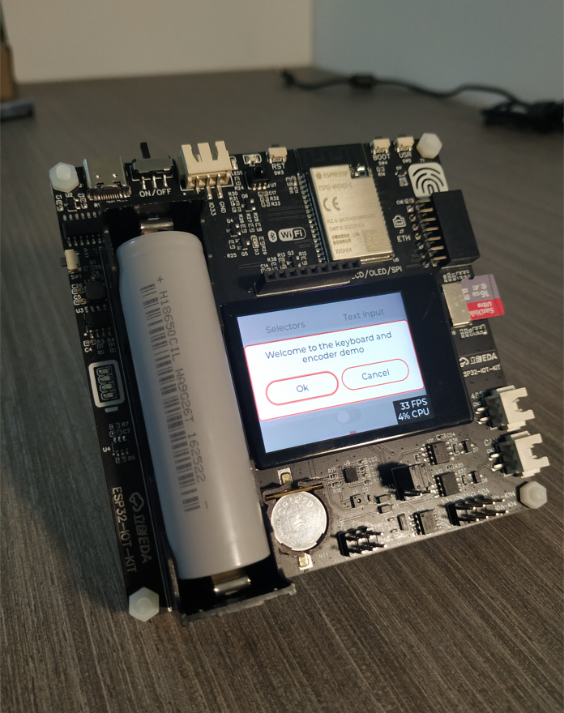
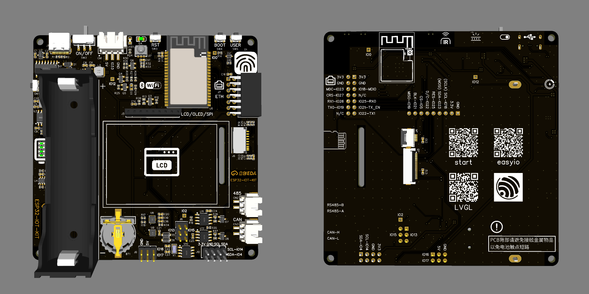

# Easyio 开源驱动库

***

&emsp;&emsp;`Easyio` 是一款适配于`ESP-IDF`框架的`开源驱动库`，以支持`ESP32`的简便开发。其目的是在保持官方SDK灵活性的同时，大幅度简化乐鑫`ESP-IDF`开发框架的使用难度。（方便的话，有开源的Arduino和Platform可以用，但在工作上有时会硬性要求使用`ESP-IDF`，毕竟要对接FAE，于是就萌生了搞个 `Easyio` 的想法）

&emsp;&emsp;功能上，`Easyio` 已初具雏形，目前涵盖如下的驱动：
* LED、GPIO（+中断）
* 按键（队列方式，数目几无上限）、触摸按键
* ADC（8通道）、DAC（2通道）
* LEDc、PWM（+输入捕获）、PCNT（编码器计数）
* RMT红外、RMT-WS2812B-RGB灯带
* UART、RS485
* I2C_TOOLS、I2C_MPU6050、I2C_AHT20
* SPI液晶屏（支持`ST7735`、`ST7735S`、`ST7789V`、`ILI9341`、`ILI9488`、`ILI9481`、`ST7796S`、`HX8357C`8种IC，涵盖3.5寸以下的绝大多数液晶模组）
* SPI_AS5047P/TLE5012B 磁编码器。
* FT5/6xxx电容触摸屏。
* FATFS、NVS、VFS、SD_CARD（SPI模式，1/4线SDIO模式）。
* jpg解码（TJpgDec）
* LCD 可以以 `SPI-DMA 双缓冲环形队列`的方式刷屏。（320x240分辨率，RGB565，SPI以`80MHz`速率通信，最大刷屏帧率`53FPS`；40MHz也能有`30.2FPS`。目前DMA加速仅完美支持`ILI9341`、`ST7789V`两种驱动IC型号的屏幕）
* LCD显示波动动效。
* mbedtls 加密算法库。
* WIFI的 TCP、UDP、HTTP、MQTT、SNTP、SCAN 的Demo。
* cJson合成、解析。
* MQTT阿里云物联网设备连接认证。
* `WIFI配网`：SmartConfig、EspTouch、AirKiss、Blufi 齐了，以后抽空将WEB配网补上。
* LAN8720有线以太网。同时支持`IP101`、`DP83848`、`RTL8201`和`DM9051`。
* LVGL暂时只Fork了官方的Demo，修改了sdkconfig，使其适配开发板的 `ST7789V` + `FT6236U`单点电容屏。后续会完善大量Demo来演示其控件和功能使用。
* LVGL_v8可用，流畅度较v7大大提高，可以更好的适配v8的模拟器。
* 蓝牙、GUI待续......
* OTA可能要鸽了，能跑会用，但要整合到库中很费事。


***


# Demo列表及功能概述

| Demo名称      | 功能概述 |
| ----------- | :-----------: |
| 01_blink      | 使用乐鑫的VsCode插件，从SDK的Demo列表中新建工程【必会，IDF自带的例程是最好的学习资源】 |
| 02_ledBlink   | 以例程01为例，通过修改CMakeLists.txt，来定制属于自己的工程【必会，以便管理有众多.c.h的项目】 |
| 03_easyio_led      | 初建easyio驱动库，驱动led常亮、闪烁  |
| 04_GPIO_IN_OUT   | GPIO 输入输出驱动  |
| 05_Task      | 熟悉 FreeRTOS 的 Task 使用，实现多任务编程  |
| 06_GPIO_INTR   | GPIO 中断输入   |
| 07_GPIO_INTR_Queue   | GPIO 中断输入 + FreeRTOS 的 Queue 消息队列   |
| 08_KEY   | 基于中断和消息队列的完整按键驱动，支持多按键、防抖、短按、长按 的调整 |
| 09_TouchPad    | 触摸传感器外设，触摸按键  |
| 10_LEDc_PWM   | LEDC外设，专用于输出超多通道低速PWM        |
| 11_ADC    | ADC1的使用，测量板载 电池电压 和 光敏电压    |
| 12_DAC   | DAC的使用，生成三角波，并用ADC测量端口电压值   |
| 13_MCPWM_DC_MOTOR   | 使用MCPWM外设，驱动直流电机，可设置相位同步、相移、反相  |
| 14_MCPWM_HALF_BRIDGE  | 使用MCPWM外设，驱动半桥，可设置相位同步、相移、反相   |
| 15_MCPWM_SERVO   | 使用MCPWM外设，控制舵机摆角，可设置相位同步、相移  |
| 16_MCPWM_CAPTURE_2Timer6IO | MCPWM用作输入捕获功能，捕获输入信号的周期、频率、高电平时间、占空比  |
| 17_PCNT_Encoder  | Pulse_cnt使用，进行ABI正交编码器、Step/Direction步进/方向 编码器的计数  |
| 18_RMT_IR_RX  | RMT外设，解析38KHz红外信号（NEC格式） |
| 19_RMT_IR_RX_TX   | 38KHz红外遥控的发射，和接收解析  |
| 20_RMT_1WIRE_WS2812B  | RMT外设，驱动单线通信灯带-WS2812B，HSV->RGB色域转换   |
| 21_UART1_TX_RX  | uart1串口数据的发送、接收，进行UART串口通信  |
| 22_UART0_TX_RX_QUEUE  | uart0串口数据的发送、接收，使用消息队列去接收数据  |
| 23_UART0_TX_RX_QUEUE_PATTERN  | uart0的`模式检测`功能，并不实用  |
| 24_UART1_RS485_FLOWCON  | uart1串口作RS485通信   |
| 25_I2C_TOOLS  | i2c_tools使用，类似linux的I2C工具，可用来测试I2C总线上的设备，极大方便I2C设备的开发调试  |
| 26_I2C_MPU6050   | 驱动I2C总线上的6轴IMU，兼容 MPU6050/9250、ICM-20600/2/8   |
| 27_I2C_AHT20   | AHT20 / AHT21 温湿度传感器（I2C器件地址与FTxxxx电容屏冲突，不建议用）   |
| 27x1_I2C_SHT30  | SHT30温湿度传感器   |
| 27x2_I2C_PCF8563_RTC  | RTC芯片，PCF8563万年历   |
| 28_SPI_LCD_ILI9341...ST7789...  | SPI-DMA方式驱动LCD，支持的型号有 ILI9341/9488/9481、ST7735/7789/7796、HX8357C，最高80MHz的SPI速率，支持 横屏、竖屏、镜像显示   |
| 29_SPI_AS5047P   | SPI驱动AS5047P磁编码器，读取磁极转子角度  |
| 30_SPI_TLE5012B   | SPI驱动TLE5012B磁编码器，读取磁极转子角度  |
| 31_SPI_LCD_I2C_TOUCH_CTP   | FT6236U(单点电容触摸)，驱动兼容FTxxxx其他型号，最大支持5点   |
| 32_NVS  | NVS，键值对存储，记录模组总开机次数   |
| 33_FATFS_SD_CARD  | FATFS文件系统对SD卡挂载，支持SPI/SDIO连接方式。VFS虚拟文件系统操作文件  |
| 34_FATFS_SD_CARD_LCD  | 使用同一SPI接口，同时驱动LCD和SD卡，提高ESP32的IO利用率  |
| 35_JPG_LCD_DMA  | .jpg图片解码，并通过SPI-DMA显示到液晶屏上   |
| 36_JPG_LCD_DMA_EFFECT  | .jpg解码，动效显示。去除动效即可用来测试FPS帧率   |
| 37_JPG_LCD_DMA_SD_PHOTO_ALBUM  | TF卡电子相册，解码后超出ESP32可用内存容量的图片会直接跳过  |
| 38_WIFI_station  | WIFI的STA模式，按用户配置连接指定WIFI热点，进行DHCP   |
| 39_WIFI_softAP  | WIFI的AP模式，按用户配置创建WIFI热点   |
| 40_WIFI_tcp_client  | ESP32建立socket。以TCP Client的身份，连接Server，回传消息   |
| 41_WIFI_tcp_server | 建立socket。以TCP Server的身份，等待Client连接，并回传消息  |
| 42_WIFI_udp_client  | 建立socket，以UDP的通信方式去发送消息，并回传消息  |
| 43_WIFI_udp_server  | 建立socket，开启UDP，等待并监听消息，将收到的消息原路返回  |
| 44_WIFI_http_request  | 建立Socket，HTTP GET，接收网页内容   |
| 45_WIFI_http_request_weather_cjson  | 借助 `心知天气` 的 HTTP-API，获取未来3日天气。cJson使用  |
| 46_WIFI_http..._cjson_free_15days  | 借助 `sojson网` 的 HTTP-API，获取未来15日天气。cJson使用  |
| 47_WIFI_MQTT  | MQTT连接公网broker，下发指令控制LED。提供公网服务器后台和测试账号  |
| 48_mbedtls_sha1_md5_AES_HmacSha1  | mbedtls测试，测试 sha、HmacSha、MD5、AES 加密算法库，base64编码测试  |
| 49_WIFI_MQTT_Aliyun_IOT_Platform  | MQTT连接`阿里云`物联网平台，上报温湿度、电压、光强，云端控制板载LED状态   |
| 50_WIFI_SNTP_DeepSleep  | SNTP对时(NTP简化版) + 深度睡眠 + RTC RAM  |
| 51_WIFI_Scan  | WIFI 扫描可用的 AP 集（WIFI热点）  |
| 52_WIFI_SmartConfig_EspTouch_AirKiss  | SmartConfig 给 WIFI配网，使用手机 EspTOUch APP 或者 微信Airkiss小程序。并保存可用SSID和密码，重启自动连接  |
| 53_Blufi  | Blufi蓝牙配网，配网更安全迅速。并保存可用SSID和密码，重启自动连接  |
| 54_ETH_DHCP  | LAN8720有线以太网，DHCP从路由器或交换机获得IP  |
| LVGL_v7工程  | [lvgl7仓库链接](https://github.com/ZhiliangMa/lv_port_esp32)。适配开发板的 `ST7789V` + `FT6236U`单点电容屏  |
| LVGL_v8  | [lvgl8仓库链接](https://github.com/ZhiliangMa/lvgl_v8_esp32)。较v7相比，流畅度大大提高，可以更好的适配v8的模拟器  |
| ETH、BLE、GUI 待续...  |         |
| 觉得好用就star下吧  |       |
| 详细说明见各Demo内的README文档  |       |
| 图文教程会在CSDN博客中更新  |  [CSDN博客ESP32教程](https://blog.csdn.net/Mark_md/article/details/120157812?spm=1001.2014.3001.5501)  |
| 开发板小批量生产中，12月TB上架  |    |
| 提供公网MQTT后台管理账号  |  此账号大家不要瞎搞，共建文明开源环境  |


<br/>

&emsp;&emsp;借助`ESP-IDF`强大的框架底层，`Easyio`在此基础上对其API进行了二次封装，并添加了许多常用外设芯片的驱动代码。做到了一行API一个外设，一段代码一个功能。完善库的同时，给每个外设都提供了测试`Demo`，每个`Demo`都提供了`README`文档。并在`.c.h`源码保留了大量母语注释，注释比代码多系列，上手极为简便。

&emsp;&emsp;目前已提供包含以上功能的50个`Demo`，未来打算继续加入OTA、LVGL、WIFI/BLE、有线以太网和一些网络通信的Demo，丰富库的应用范围。

***

# ESP32开发环境的搭建
ESP32开发环境的搭建：[在windows上基于ESP-IDF、VsCode搭建ESP32开发环境](https://blog.csdn.net/Mark_md/article/details/120132945?ops_request_misc=%257B%2522request%255Fid%2522%253A%2522163604166516780274134538%2522%252C%2522scm%2522%253A%252220140713.130102334.pc%255Fblog.%2522%257D&request_id=163604166516780274134538&biz_id=0&utm_medium=distribute.pc_search_result.none-task-blog-2~blog~first_rank_v2~rank_v29-4-120132945.pc_v2_rank_blog_default&utm_term=%E5%BC%80%E5%8F%91%E7%8E%AF%E5%A2%83&spm=1018.2226.3001.4450)

***

# 如何使用easyio

&emsp;&emsp;库的导入方式异常简便，直接将`easyio_lib`文件夹，拖入自己工程的 `components` 文件夹下。并在`main.c`包含头文件`#include "easyio.h"`，即可使用Easyio的全部功能。

&emsp;&emsp;使用教程见我的CSDN博客：

&emsp;&emsp;[ESP32开源驱动库Easyio的使用](https://blog.csdn.net/Mark_md/article/details/120157812?spm=1001.2014.3001.5501)

***

# 在线文档

&emsp;&emsp;在线文档正在补全中，一些常用的API和Demo的简介、操作步骤都会放在这里，作为一种补充本地文档的手段，也方便在线阅读。Github、Gitee同步，Gitee国内网速会快一些。

&emsp;&emsp;[Easyio.doc-Github](https://zhiliangma.github.io/easyio.doc)

&emsp;&emsp;[Easyio.doc-Gitee](http://zhiliangma.gitee.io/easyio.doc)

***

# 配套开发板情况、原理图（硬件全开源）

&emsp;&emsp;硬件全开源，PCB工程使用立创EDA绘制，详见下面链接。；不要白嫖哦，点颗星星再走嘛。

&emsp;&emsp;开发板在改最后一些细节，预计11月末小批量生厂，12月可以跟大家见面，以上的Demo除了MCPWM（引出的IO少），都可以完美运行。板载电池，主电源部分为UPS，保证脱机稳定性，也便于小规模集群测试。本来还担心当地贴片厂没有AOI还贵，JLC现在都有了，嘉立创赛高 ！！

&emsp;&emsp;`原理图`已先行上传，**`Schematic_ESP32-IOT-KIT_2022-01-07.pdf`**。

&emsp;&emsp;[开发板原理图sch](Schematic_ESP32-IOT-KIT_2022-01-07.pdf)

&emsp;&emsp;PCB工程：[立创EDA - ESP32-IOT-KIT物联网开发板](NULL)

&emsp;&emsp;看都看到这儿了，还不多多star、点赞收藏。๑乛◡乛๑ 嘿嘿

&emsp;&emsp;交流群会过几周建立，有兴趣的可以先到我CSDN博客里私信。






***

# 个人博客

[CSDN blog - ESP32专栏](https://blog.csdn.net/mark_md/category_10794878.html)

&emsp;&emsp;后续会同步更新`ESP-IDF`的使用方法和技巧，以及 `easyio` 配套 `ESP32-IOT-KIT开发板`的使用教程，求赞求粉求关注。

***

# 清理工程，减小体积

&emsp;&emsp;`cleanBuild.bat` 为编译文件的`清理脚本`，鼠标双击运行，可删除同文件夹下所有工程的编译文件。一般一个工程的大小在几百KB，但编译后会生成100多MB的 `build` 文件，清理后可大大减少存储占用空间。每次push源码前先运行下此脚本，清理所有工程，方便同步到 `Github` 仓库。

***

# 注意

* `Easyio`建议搭配`ESP-IDF`的`V4.2`版本使用，V4.3版本与我的`Easyio`驱动库有兼容性问题。发现很多奇怪现象，不单单是编译不通过的问题，有些能编译但在硬件上运行报错，就很离谱。而这些问题在`V4.2`上则不存在。鉴于`V4.2`已经对ESP32提供了足够的支持，`V4.3`着重添加了`ESP32-S2/C3`的功能，而自己的`easyio`库暂时没有兼并`ESP32-S2/C3`的精力，于是推荐使用`V4.2`版本。

***

# 版权声明

&emsp;&emsp;本源码遵守MIT开源协议。如使用此仓库工程及源码，请注明作者及来源。

```
MIT License

Copyright (c) 2021 ZhiliangMa
Copyright (c) https://github.com/ZhiliangMa/easyio-lib-for-esp32

Permission is hereby granted, free of charge, to any person obtaining a copy
of this software and associated documentation files (the "Software"), to deal
in the Software without restriction, including without limitation the rights
to use, copy, modify, merge, publish, distribute, sublicense, and/or sell
copies of the Software, and to permit persons to whom the Software is
furnished to do so, subject to the following conditions:

The above copyright notice and this permission notice shall be included in all
copies or substantial portions of the Software.

THE SOFTWARE IS PROVIDED "AS IS", WITHOUT WARRANTY OF ANY KIND, EXPRESS OR
IMPLIED, INCLUDING BUT NOT LIMITED TO THE WARRANTIES OF MERCHANTABILITY,
FITNESS FOR A PARTICULAR PURPOSE AND NONINFRINGEMENT. IN NO EVENT SHALL THE
AUTHORS OR COPYRIGHT HOLDERS BE LIABLE FOR ANY CLAIM, DAMAGES OR OTHER
LIABILITY, WHETHER IN AN ACTION OF CONTRACT, TORT OR OTHERWISE, ARISING FROM,
OUT OF OR IN CONNECTION WITH THE SOFTWARE OR THE USE OR OTHER DEALINGS IN THE
SOFTWARE.
```

***

# 乐鑫ESP-IDF 在线帮助文档

[ESP-IDF 快速入门](https://docs.espressif.com/projects/esp-idf/zh_CN/latest/esp32/get-started/index.html#get-started-step-by-step)

[ESP-IDF API编程指南](https://docs.espressif.com/projects/esp-idf/zh_CN/stable/esp32/api-reference/index.html)

[ESP32 硬件设计参考](https://docs.espressif.com/projects/esp-idf/zh_CN/stable/esp32/hw-reference/index.html)
